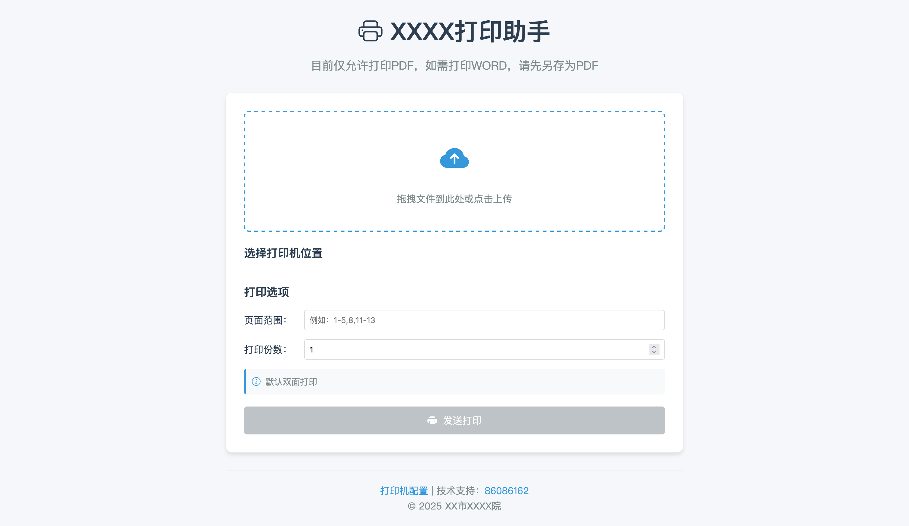

# 网络打印助手 (Print Helper)

[](LICENSE)

网络打印助手是一个专门设计用于解决国产操作系统下打印机兼容性问题的Web应用程序。通过提供统一的打印服务接口，实现跨平台打印功能，确保在各种操作系统环境下都能稳定可靠地完成打印任务。

## 功能特点

- 🖨️ 跨平台打印支持
- 🔄 统一的打印队列管理
- ⚙️ 灵活的打印机配置
- 🌐 Web界面管理
- 📝 打印任务状态追踪
- 🔍 打印机连接测试

## 预览



## 系统要求

- Windows服务器（推荐Windows Server 2016或更高版本）
- Node.js 14.x或更高版本
- 网络打印机及其驱动程序
- 稳定的网络环境

## 快速开始

### 安装

1. 克隆仓库：
```bash
git clone [repository-url]
cd print-helper
```

2. 安装依赖：
```bash
npm install
```

3. 配置环境变量：
```bash
cp .env.example .env
# 编辑.env文件，设置必要的环境变量
```

4. 配置打印机：
   - 确保Windows服务器已安装所需的打印机驱动
   - 在`config/printers.json`中配置打印机信息

### 启动服务

开发模式：
```bash
npm run dev
```

生产模式：
```bash
npm start
```

## 使用说明

1. 访问Web界面：
   - 打开浏览器访问 `http://localhost:3000`（或配置的其他端口）

2. 打印机管理：
   - 通过Web界面添加/删除打印机
   - 配置打印机参数
   - 测试打印机连接

3. 打印任务：
   - 提交打印任务
   - 查看打印队列
   - 管理打印状态

## 项目结构

```
├── config/             # 配置文件目录
├── public/             # 静态资源文件
├── utils/              # 工具函数
├── server.js           # 服务器入口文件
├── package.json        # 项目依赖配置
└── DEPLOYMENT.md       # 部署文档
```

## 贡献指南

欢迎提交问题和改进建议！如果您想贡献代码：

1. Fork 项目
2. 创建您的特性分支 (`git checkout -b feature/AmazingFeature`)
3. 提交您的更改 (`git commit -m 'Add some AmazingFeature'`)
4. 推送到分支 (`git push origin feature/AmazingFeature`)
5. 打开一个 Pull Request

## 许可证

本项目采用 Apache License 2.0 许可证 - 查看 [LICENSE](LICENSE) 文件了解详情

## 技术支持

如果您在使用过程中遇到问题，请：

1. 查看 [DEPLOYMENT.md](DEPLOYMENT.md) 获取详细的部署指南
2. 提交 GitHub Issues
3. 联系技术支持团队